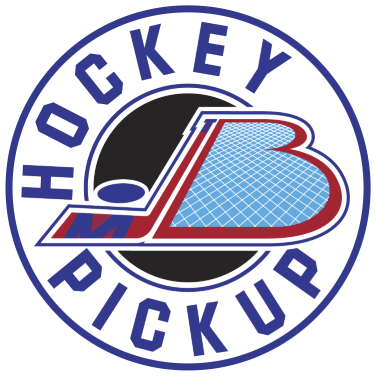

# 🏒 HockeyPickup.Comms

[](https://hockeypickup.com)

[](https://github.com/HockeyPickup/HockeyPickup.Comms/actions/workflows/hockeypickup-comms-github.yml)
[](https://github.com/HockeyPickup/HockeyPickup.Comms/actions/workflows/github-code-scanning/codeql)

## 🌈 Overview

HockeyPickup.Comms is an implementation of interacting with the HockeyPickup Platform via Communication (Email, Notifications, etc.). It's deployed as an Azure Functions project and uses [Azure Service Bus](https://azure.microsoft.com/en-us/products/service-bus).

The main technology stack platform is [.NET Core](https://dotnet.microsoft.com/) 9.0.

## 🛠 Prerequisites

* Install Visual Studio 2022 (preview) or later, or Visual Studio Code. Ensure that `$ dotnet --version` is at least 9.0.

## ⌨️ Install, Build, and Run the Comms

Create a new file at the root of the HockeyPickup.Comms project named `local.settings.json`.

Get the `ServiceBusConnectionString` from Azure portal. Currently Service Bus is not available to run locally.

Get the `SendGridApiKey` from [SendGrid](https://sendgrid.com/en-us/solutions/email-api-v2).

```json
{
  "IsEncrypted": false,
  "Values": {
    "AzureWebJobsStorage": "UseDevelopmentStorage=true",
    "FUNCTIONS_WORKER_RUNTIME": "dotnet-isolated",
    "ServiceBusConnectionString": "<ServiceBusConnectionString>",
    "ServiceBusCommsQueueName": "comms-dev",
    "SendGridApiKey": "<SendGridApiKey>",
    "SendGridFromAddress": "pickup@hockeypickup.com",
    "SignInAlertEmail":  "pickup@hockeypickup.com"
  }
}
```

### Install the packages

```bash
$ dotnet restore
$ dotnet tool restore
```
Open HockeyPickup.Comms.sln solution in Visual Studio, and build the solution.

## 🎛️ Refreshing the models from HockeyPickup.Api

HockeyPickup.Comms uses C# models via the OpenAPI spec from the [HockeyPickup.Api](https://github.com/HockeyPickup/HockeyPickup.Api/) schema.

To refresh the models, use `nswag`.

Nswag is installed in this project as a `dotnet tool`.

Local: `$ dotnet nswag swagger2csclient /client-language:csharp /input:https://localhost:7042/swagger/v1/swagger.json /output:HockeyPickup.Api.cs /namespace:HockeyPickup.Api`

Production: `$ dotnet nswag swagger2csclient /client-language:csharp /input:https://api.hockeypickup.com/swagger/v1/swagger.json /output:HockeyPickup.Api.cs /namespace:HockeyPickup.Api`

## 🎁 Versioning

HockeyPickup.Comms uses [sementic versioning](https://semver.org/), starting with 1.0.0.

The patch (last segment of the 3 segments) is auto-incremented via a GitHub action when a pull request is merged to master. The GitHub action is configured in [.github/workflows/hockeypickup-Comms-version.yml](.github/workflows/hockeypickup-Comms-version.yml). To update the major or minor version, follow the instructions specified in the [bumping section of the action](https://github.com/anothrNick/github-tag-action#bumping) - use #major or #minor in the commit message to auto-increment the version.

## ❤️ Contributing

We welcome useful contributions. Please read our [contributing guidelines](CONTRIBUTING.md) before submitting a pull request.

## 📜 License

HockeyPickup.Comms is licensed under the MIT license.

[]((https://github.com/HockeyPickup/HockeyPickup.Comms/master/LICENSE))

[hockeypickup.com](https://hockeypickup.com)
<!---
Icons used from: https://emojipedia.org/
--->